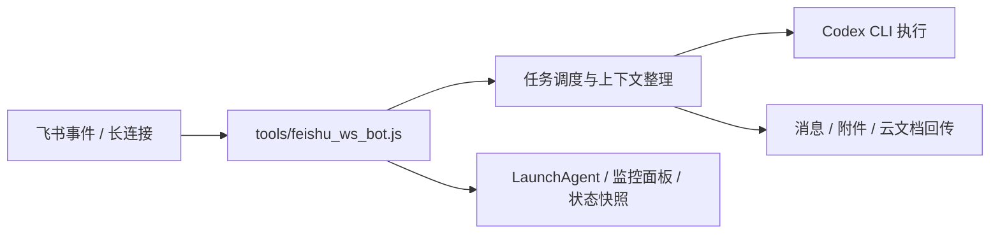

# SunCodexClaw Project Overview

这份文档是给项目 owner 自己看的系统总览。

它的目的不是替代 `README.md`，而是帮助在中断一段时间后，快速重新建立对当前实现、模块边界、配置模型和本地增强的整体认知。

## 项目定位

`SunCodexClaw` 当前的核心形态不是“通用聊天壳”，而是“飞书消息驱动的本机 Codex 执行器”。

它解决的是这样一类问题：

- 用户在飞书里发任务
- 机器人把消息、附件、引用上下文整理成适合 Codex 的输入
- 在绑定工作目录里执行 `codex exec`
- 把进度、最终文字、文件、图片或文档链接再回到飞书

当前边界比较明确：

- 已实现平台是飞书，入口是长连接 WebSocket 事件
- 运行时以本机 `codex` CLI 为核心，不是自己实现一套 agent engine
- 重点是“消息到执行到回传”的闭环，而不是做跨平台统一抽象

这也意味着目前的主复杂度并不在模型 prompt，而在平台适配、任务调度、上下文整理、附件处理和回传链路。

## 运行架构

当前运行时可以粗分成五层。

### 1. 飞书接入层

入口基本都在 `tools/feishu_ws_bot.js`。

这一层负责：

- 读取飞书配置与凭证
- 建立 WebSocket 长连接
- 订阅 `im.message.receive_v1`
- 解析飞书消息体、附件、图片、语音、富文本
- 把原始飞书事件变成内部可处理的任务输入

这里仍然是当前系统最重的集成点，说明项目还没有完全模块化成“平台适配器 + 核心引擎”。

### 2. Codex 执行层

Codex 仍然直接通过 `codex` CLI 执行，核心逻辑也在 `tools/feishu_ws_bot.js`。

这一层负责：

- 组装 prompt
- 选择 `cwd`、`add_dirs`、模型、推理强度
- 复用或新建 Codex thread
- 调用 `codex exec --json`
- 消费执行过程事件
- 处理 resume / policy mismatch / thread title 同步

线程记忆有两层：

- 机器人进程内维护的本地线程状态
- `~/.codex/state_*.sqlite` 里的 Codex 线程状态

这两层配合后，飞书侧会话和 Codex CLI 的真实 thread 才能稳定续上。

### 3. 任务调度与上下文层

这一层决定“消息怎么进入任务系统”，现在已经从主脚本里拆出一批 helper：

- `tools/lib/task_queue.js`
- `tools/lib/message_actionability.js`
- `tools/lib/mention_carry.js`
- `tools/lib/feishu_dispatch_envelope.js`
- `tools/lib/referenced_message_context.js`

这一层的职责是：

- 以会话 scope 为单位排队或 supersede
- 处理群里 `@` 触发与 mention carry
- 判断一条后续消息是否有资格打断当前任务
- 把引用消息正文拼进当前 prompt
- 保护群聊里不同人的任务不要互相乱打断

### 4. 反馈层

反馈层分成三条输出通道：

- 直接文本回复
- 飞书原生附件 / 图片回传
- 飞书云文档进度

相关文件包括：

- `tools/lib/feishu_reply_rendering.js`
- `tools/lib/feishu_reply_directives.js`
- `tools/lib/feishu_chat_target.js`
- `tools/lib/feishu_chat_routing.js`
- `tools/lib/docx_append_batches.js`

现在回复层已经不只是“发一段文本”，而是支持：

- 普通文本和 Markdown 卡片自动切换
- 从模型输出里提取 `[[FEISHU_SEND_FILE:...]]` / `[[FEISHU_SEND_IMAGE:...]]`
- 按群名查找目标群并把最终文本发到别的群
- 文档进度分批写入，避免单次 block 数过大失败

### 5. 本机运行与常驻层

这层主要负责“让机器人长期在你的电脑上稳定活着”，核心文件是：

- `tools/install_feishu_launchagents.sh`
- `tools/feishu_bot_ctl.sh`
- `tools/lib/runtime_status_store.js`
- `tools/lib/feishu_runtime_status.js`
- `tools/lib/monitor_snapshot.js`
- `tools/feishu_monitor_server.js`

这一层已经具备：

- 多机器人 LaunchAgent 常驻
- 每个账号单独状态快照
- 本机监控面板
- 存活 / 卡死 / 当前阶段判断

## 消息与任务链路

从飞书收到一条消息到最终回传，当前链路大致如下。

1. `tools/feishu_ws_bot.js` 收到 `im.message.receive_v1` 事件。
2. 事件先经过 `buildConversationScope` 和 `buildDispatchEnvelope`，决定任务 scope、是否允许 mention carry、是否有 supersede 资格。
3. `dispatchQueuedByChat` 负责把任务放进当前会话队列；同 scope 默认顺序执行，只有明确满足规则时才会 supersede。
4. `handleMessageEvent` 进一步做消息归一化：
   - 文本消息提取正文
   - 图片消息下载成本地文件路径
   - 文件消息下载到临时目录
   - 语音消息下载后再转写
   - 引用消息会通过 `referenced_message_context` 额外拉原消息正文
5. 归一化后的用户输入会进入线程系统：
   - 命中 `/thread` 或 `/reset` 就走本地线程命令
   - 否则进入 Codex 执行链路
6. 执行前会构造 Codex prompt，并把当前线程历史、引用消息、附件路径、图片路径等整理进去。
7. `codex exec --json` 开始运行；运行期间状态会写入运行时快照，必要时也会写飞书进度文档。
8. 模型最终输出先经过 `extractFeishuReplyDirectives`：
   - 保留正文
   - 提取附件发送 directive
   - 提取目标群 directive
9. 最终回复阶段再决定如何回传：
   - 纯文本回复到当前群
   - Markdown 内容优先走飞书卡片
   - 需要跨群时，先用 `chat.search` 解析群名，再把最终普通文本发到目标群
   - 附件和图片则回发到当前会话
10. 成功、失败或取消都会更新运行时状态；任务结束后回到 idle。

几个对当前体验影响很大的细节：

- 群聊现在不是简单“来一条就执行”，而是“同群同发送者有自己的任务 scope”
- “先 `@` 再补文件 / 图片 / 语音 / 文本”的工作流已经被显式支持
- 只引用别人消息但不补正文时，机器人现在也能把被引用内容拿来作为上下文

## 关键模块索引

下面这份索引的目标不是列全文件，而是告诉以后自己“先去哪里看”。

### 运行时主入口

- `tools/feishu_ws_bot.js`

这是第一阅读入口。飞书接入、Codex 调用、线程逻辑、进度回传、状态更新都在这里汇合。

如果只想快速理解系统怎么跑，先看这个文件。

### 配置与密钥存取

- `tools/lib/local_secret_store.js`

这个模块负责：

- `local.yaml` 的读取、缓存、写回
- 配置段的 deep merge
- 账号级配置的 upsert

凡是 `bot_open_id` 自动回写、账号配置动态合并，最后都会落到这里。

### 任务调度与消息可执行性

- `tools/lib/task_queue.js`
- `tools/lib/message_actionability.js`
- `tools/lib/feishu_dispatch_envelope.js`

这些文件决定：

- 队列怎么排
- 当前活动任务能不能被后续消息打断
- 哪些后续消息只是排队，哪些会 supersede

如果群里出现“乱打断”或“该打断却没打断”，先看这里。

### 群聊触发补偿链路

- `tools/lib/mention_carry.js`

这个模块处理的是“群里先 `@` 一次，随后继续发内容”的窗口逻辑，以及群文件是否允许不带新 `@` 直接进入任务。

如果问题是“群里明明刚 `@` 过，为什么后续文件/文本没接上”，优先看这里。

### 引用消息上下文

- `tools/lib/referenced_message_context.js`

如果问题是“引用回复里的原文为什么没进 prompt”，看这个模块。

### 线程与本地会话记忆

- `tools/feishu_ws_bot.js`

线程命令、会话历史、Codex thread 绑定和 `/reset` 逻辑目前还主要在主脚本里，没有完全拆到独立模块。

如果问题和 `/thread new`、`/thread switch`、历史轮数或 Codex resume 有关，直接回主脚本对应段落看会更快。

### 回复渲染、附件 directive 与跨群投递

- `tools/lib/feishu_reply_rendering.js`
- `tools/lib/feishu_reply_directives.js`
- `tools/lib/feishu_chat_target.js`
- `tools/lib/feishu_chat_routing.js`

这些模块负责：

- 判断何时用 Markdown 卡片
- 提取模型输出里的附件 / 目标群 directive
- 根据群名搜索 `chat_id`
- 把最终回复投递到当前群或目标群

### 云文档进度

- `tools/lib/docx_append_batches.js`

这个模块的存在是为了绕过飞书 docx 单次 block 数限制。

如果以后再碰到“进度文档写入 `field validation failed`”，先看这里。

### 运行时状态与监控面板

- `tools/lib/runtime_status_store.js`
- `tools/lib/feishu_runtime_status.js`
- `tools/lib/monitor_snapshot.js`
- `tools/feishu_monitor_server.js`

这部分负责把 bot 当前阶段写成快照，再由本机 HTTP 面板读出来。

如果要排查“机器人活着没有、现在在等什么、是不是卡死了”，从这组文件开始。

## 配置与多机器人模型

### 配置叠加顺序

当前有效配置不是单文件，而是分层叠加的。

对于非 `default` 账号，优先级从低到高大致是：

1. `config/feishu/default.json`
2. `config/secrets/local.yaml` 里的 `feishu.default`
3. `config/feishu/<account>.json`
4. `config/secrets/local.yaml` 里的 `feishu.<account>`
5. 环境变量
6. CLI 参数

`default` 账号更简单，本质上就是 `default.json + local.yaml/default + env + cli`。

也就是说：

- 非敏感默认项适合放 `config/feishu/*.json`
- 敏感项和本机私有项适合放 `config/secrets/local.yaml`
- 想临时覆盖时用 env 或 CLI

### 多机器人是怎么分开的

当前多机器人模型是“按账号起独立进程”。

每个账号都有自己的一份：

- 飞书凭证
- bot 名字与 alias
- `codex.cwd`
- 运行时内存状态
- 任务队列
- 线程状态
- 运行时状态快照
- LaunchAgent 实例

这意味着不同机器人不会共享当前任务、当前会话历史或当前队列。

### 当前已经做到的隔离

当前已经比较明确的隔离包括：

- 进程隔离
- 账号级配置隔离
- 工作目录隔离
- 日志隔离
- 运行状态快照隔离

### 当前还没有做到完全隔离的地方

目前还不是“完全硬隔离”。

仍然存在的宿主级共享项包括：

- 同一套仓库代码
- 同一份 `config/secrets/local.yaml`
- 同一宿主用户下的 `~/.codex/state_*.sqlite`
- 同一台机器上的全局 `codex` / `ffmpeg` / Node 环境

所以更准确的说法是：

- 会话和任务层面，已经基本按 bot 隔离
- 底层宿主资源层面，仍然有共享

如果以后要继续加固隔离，最直接的方向是每个 bot 拆独立 `CODEX_HOME`，并减少默认 alias 的跨账号共享。

## 当前已做增强

下面这些能力都已经是当前实现的一部分，不再只是临时 patch。

### 1. 机器人名字与 `bot_open_id` 协调

机器人现在不只依赖固定 `bot_open_id`，还会结合群里真实 mention 名字做识别，并在可确定时回写 `bot_open_id`。

这让“机器人改名后群里突然不响应”这类问题没那么脆弱。

### 2. 群聊 mention carry

群里已经支持：

- 先 `@机器人`
- 再单独发文本、文件、图片、语音、富文本

后续消息会继续进入同一轮任务，而不是每条都要求重新 `@`。

### 3. 群文件放行

群文件现在可以在满足补偿链路时不带新 `@` 直接进入处理，不再因为 mention gate 被整条丢掉。

### 4. 引用消息进入上下文

引用回复不再只看“当前输入的几个字”，而是会先拉取被引用的原消息，把它整理成 `引用消息 + 当前消息` 再交给 Codex。

### 5. 同 scope 排队与 supersede 规则

当前不是“后一条必然顶掉前一条”，而是：

- 默认排队
- 纯空 ping 不抢占任务
- 只有满足规则的消息才 supersede
- 群里其他人的消息不会随便打断当前发送者的任务
- 原发送者再次明确 `@` 机器人时，才允许 supersede 当前任务

### 6. 按群名投递最终文本结果

模型现在可以通过 directive 把最终普通文本发到别的群：

- 唯一命中则投递
- 多个候选则回候选列表
- 没找到则直接报未找到

这让“在一个群里下指令，把结果发到另一个群”成为可用工作流。

### 7. Markdown 卡片回复

最终回复现在会按内容自动判断：

- 普通文本继续走普通消息
- 带明显 Markdown 结构的内容优先走飞书 interactive card
- 卡片发送失败时自动回退成普通文本

### 8. 云文档进度分批写入

飞书 docx 进度写入现在已经做了 block batching，避免一次写太多 children 导致失败。

### 9. 本机监控面板

项目现在已经有一个只监听 `127.0.0.1` 的本机面板，可以看：

- bot 是否在线
- 当前阶段
- 正在等什么对象
- 已等待多久
- 最近错误和最近事件

这已经把“机器人活着没有、有没有卡死”从纯日志观察提升成了可视化状态。

## 已规划能力与建议

这一节只记录已经明确讨论过的方向，不代表已经实现。

### 1. 继续加固多机器人隔离

最值得做的是：

- 每个 bot 独立 `CODEX_HOME`
- 更少依赖默认通用 alias
- 进一步减少宿主级共享状态

这是当前最现实的系统级加固方向。

### 2. 监控面板继续增强

当前面板已经能看状态，但还可以继续往下做：

- 更完整的阶段时间线
- 更明显的异常提示
- 更细的 Codex 执行阶段展示

如果以后要做远程访问或控制操作，那会是下一阶段，不属于当前版本。

### 3. 权限进一步收缩

目前系统已经整理出最小权限 JSON，但实际部署时为了省排障成本，历史上仍然给过较宽的权限集合。

后续更合理的方向是：

- 每个机器人按用途收缩 scopes
- 不再默认沿用全量权限模板

### 4. 企业微信版本可行，但属于平台适配重写

之前已经做过结论级判断：

- Codex 执行核心、任务调度、监控思路大部分可复用
- 但企业微信适配层需要单独重写
- 飞书 docx 进度这条不能 1:1 平移

所以这件事是“可行但不是小改动”，不应该和当前飞书主线混在一起推进。

### 5. 主运行时继续拆模块

虽然现在已经拆出不少 helper，但 `tools/feishu_ws_bot.js` 仍然承担了过多集成职责。

如果后面继续做大功能，最有价值的长期建议是继续把以下逻辑往外拆：

- 线程与命令系统
- Codex 执行编排
- 进度文档写入
- 飞书消息标准化

这样后面无论是加平台、做测试，还是继续维护，成本都会明显下降。
